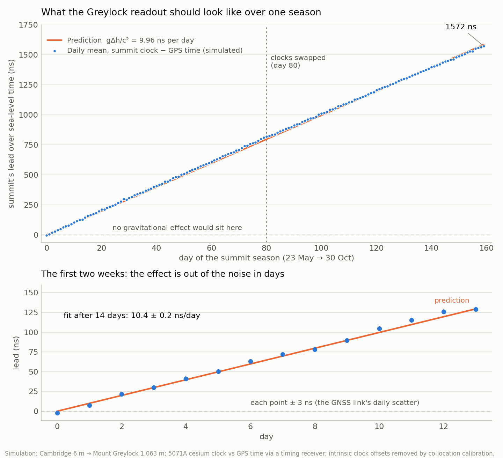
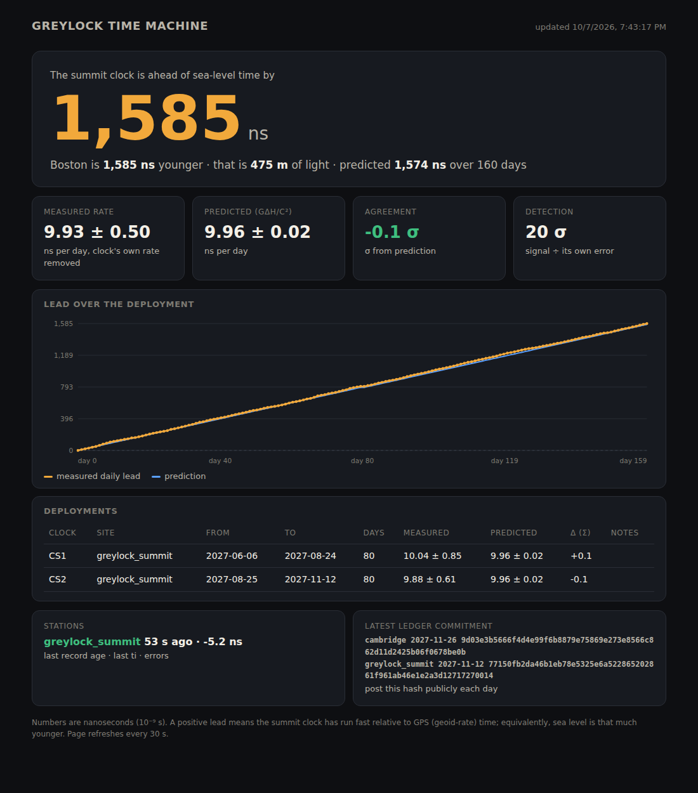

# greylock v0.1 — the time machine's software (record)

*Time Travel project · 7 October 2026. Written and tested in answer to "can we create a software for the hardware of the time machine? What kind of code?" Companion to claude/greylock-time-machine.md (the hardware design). The code itself (greylock-software.zip, 33 files, ~2,200 lines) was delivered in chat; this doc records what it is so a later session can extend it rather than rewrite it.*

## What kind of code, and why

- Python 3.11 for everything on the Raspberry Pi and for the analysis: `pyserial` drivers for the TAPR TICC counter, the u-blox receiver (UBX protocol) and the 5071A's RS-232 health port; `numpy` for the fits; the standard library for the ledger and the web server. Shriya codes Python.
- Vanilla HTML/JS/SVG for the readout page (`readout.html`), no external resources, so it runs on the Pi in the lodge with no internet.
- chrony + the GNSS PPS for the Pi's own time (deploy/chrony.conf); systemd unit for the daemon (deploy/greylock-acquire.service); install.sh.
- C++ (Arduino) only for an optional physical "futurometer" display on an ESP32 (`firmware/futurometer/futurometer.ino`, untested on hardware).
- External, existing: RTKLIB `convbin` (C) to turn the raw UBX log into RINEX for PPP later. The clock's and counter's firmware are not ours and are not touched; the package never sends the 5071A a frequency or sync command.

## Modules

| file | role |
|---|---|
| physics.py | WGS84 normal gravity, free-air gradient, geopotential above the geoid, gravitational/velocity/Sagnac rates, transport integral along a GNSS track, light-metres; Cambridge→Greylock = 1.1533e-13 = 9.96 ± 0.02 ns/day |
| clockmodel.py | noise models: cesium (white FM 5e-12 at 1 s, 5e-15 floor as a 2-day OU wander, intrinsic offset, 2e-15/°C), GNSS PPS (±4 ns sawtooth reported as qErr, 2 ns white, 2 ns 1-day systematic), case environment |
| sim.py | the digital twin: clocks with itineraries (site, days) write the same ledger records the hardware would; one ledger per site |
| ticc.py | TICC line parser (time-interval and timestamp modes), chA/chB pairing, serial reader; sign: ti = cesium PPS − GNSS PPS |
| ublox.py | UBX frame parser with resync and checksum, TIM-TP (qErr) and NAV-PVT decoders, serial reader with raw-stream tee |
| cesium.py | 5071A SCPI health polling (*IDN?, :SYSTem:PRINt?, :DIAGnostic:LOG:PRINt?, :DIAGnostic:CONTinuous?) with lenient parsing; read-only |
| env.py | BME280 temperature/pressure/humidity over I²C; dew point |
| ledger.py | append-only JSONL, SHA-256 chained (prev/hash per record), one file per UTC day, chain resumes across restarts, `verify()` names the first broken record, daily commitments file |
| acquire.py | the station daemon: threads for TICC, u-blox, cesium health, UPS (NUT); one record per pulse; heartbeat status.json; `--simulate` runs a live twin |
| analysis.py | sawtooth correction; daily medians with robust σ; segments per (clock, site); calibration = slope at the reference site; measured gravitational rate = deployment slope − calibration; prediction and σ; lead series accumulated across swaps; overlapping ADEV; honest error = fit ⊕ half the before/after calibration spread ⊕ clock floor (twice) |
| display.py + readout.html | stdlib HTTP server; /api/state (re-analysed every minute), /api/status; the page shows lead, rate vs prediction, σ, detection, lead plot, deployments table, station heartbeats, latest commitment hash |
| cli.py | `greylock predict / simulate / acquire / analyse / verify / commit / serve / adev / init` |
| station.example.toml | sites (Cambridge 6 m reference, Greylock summit 1,063.4 m), hardware ports, qerr_sign, analysis.min_calibration_days, clock_floor, and the [sim] itineraries (CS1: 14 d home, 80 d summit, 80 d home; CS2: 94 d home, 80 d summit, 14 d home) |
| tests/ | 10 pytest tests: TICC parsing and pairing, UBX round-trip/resync/NAV-PVT decode, ledger tamper detection and resume, prediction numbers, simulated season recovers the rate and calibrates the intrinsic offset away, uncalibrated clock reported not guessed, ADEV slope |

## Results on the simulated 2027 season

`+9.93 ± 0.50 ns/day vs predicted +9.96 ± 0.02 (−0.1σ); detection 20σ over 160 deployment days; lead 1,585 ns measured, 1,574 ns predicted (475 m of light)`. Per clock the intrinsic offsets (CS1 +1.2e-13 ≈ 10.4 ns/day, CS2 −0.6e-13) were calibrated out at the reference site; the per-segment error with link noise alone would be ±0.03 ns/day, the honest ±0.5 comes from the clock floor and the before/after calibration spread. The ADEV of the clock-vs-GPS series is link-dominated at short τ (5.8e-11 at 60 s), as it will be in reality.

## Conventions to remember

- ti_ns = cesium 1PPS − GNSS 1PPS on the cesium's time base (TICC REF ← cesium 10 MHz).
- corrected ti = ti + qerr_sign × qErr(ps)/1000; qerr_sign (+1/−1) is decided by the zero-baseline test (corrected jitter must shrink).
- A positive lead = summit clock ahead = sea level younger. Boston is the Wellsian traveller (ages less); the summit reaches tomorrow first.
- Heights in the config are orthometric (NAVD88) heights of the clock, not the antenna.

## Roadmap (not built)

`greylock ppp` (RINEX → PPP → 0.1–0.3 ns link points); Galileo-time cross-check; `greylock passport` visitor certificates; an X bot posting the daily lead + commitment hash; the ESP32 futurometer tested on hardware; a stepper "hand of the future" (one turn per 100 ns); GNSS track logger feeding `physics.transport_offset_ns` for the drive.

---

## v0.2 addendum — "go deeper: make it completely practical" (8 October 2026)

The v0.1 record above is kept verbatim; the code now lives in this repository at `greylock/` (38 files, ~4,200 lines — the zip unpacked to 27 files; the "33" above counted a packaging layer that did not survive the trip). v0.1's 10 tests passed unmodified before any change was made; v0.2 is 38 tests, all passing, plus an end-to-end smoke run of every command on a simulated season, plus a three-lens adversarial review (concurrency, physics/statistics, operations) whose 17 confirmed findings — 9 unique bugs after cross-lens dedup, every one reproduced by an independent refuter before it counted — are fixed with regression tests. The two worst: a single `temp_c: null` record from a station without its BME280 would have permanently crashed the entire analysis, display and exports; and the raw-log disk guard only ran at UTC midnight, so the reserve protecting the measurement records could be eaten mid-day. Honourable mention: `greylock zerobase` pooled all clocks and stations into one difference series and was therefore permanently "inconclusive" on good data — per-(station, clock) grouping turned the same simulated season from inconclusive into a decisive 2.9-vs-7.2 ns verdict for the correct sign. Also fixed: event-record floods on persistent raw-log failures, one stale-pulse event per timeout instead of per outage, a temperature coefficient attenuated by temp–time correlation (Frisch–Waugh detrending now; a purely linear drift is named as indistinguishable from clock drift rather than reported as zero), `greylock transport` silently interleaving two stations' tracks, raw UBX files without station names clobbering each other on ledger merge, and the live twin reporting qErr with the wrong sign convention.

### New in v0.2 — the operations layer (most of the roadmap, built)

| addition | what it does |
|---|---|
| `greylock doctor [--live]` (doctor.py) | bring-up self-test: config sanity, disk, chrony offset, serial ports present, and with `--live` real probes of the TICC (mode, pulse rate, ti sanity), the receiver (TIM-TP/NAV-PVT, fix, qErr) and the 5071A (*IDN?, continuous operation); exit code 1 on any failure |
| `greylock zerobase` (doctor.py) | README step 5 automated: decides qerr_sign from ledger data — corrected per-pulse jitter must shrink; says FLIP IT when config disagrees with data; honestly inconclusive on low-cadence data |
| `ti_sanity()` (doctor.py) | catches the two classic wiring mistakes: chA/chB swapped (ti within µs of ±1 s) and phase steps |
| `greylock export --what daily\|lead\|segments\|raw` (export.py) | the paper- and plot-friendly CSVs |
| `greylock report [--post]` (reportgen.py) | the operator's daily report: records, gaps, ti scatter, qErr rms, thermostat range, battery events, chain verdicts, the day's commitment hash, the current result; `--post` is the ≤280-char public line — the X bot's payload, built before the bot |
| `greylock passport` (passport.py) | the roadmap's visitor certificate: 48 h at the summit = 19.93 ± 0.05 ns banked (5,974 mm of light), text + printable single-file HTML, optionally stamped with the season's measured rate |
| `greylock transport` (export.py + physics) | the roadmap's track logger, closed: the daemon now logs lat/vel_e from NAV-PVT, and the command integrates the logged drive into its proper-time offset (the design note's ~0.35 ns leg, computed not assumed) |
| `greylock rinex` (rinex.py) | half of `greylock ppp`: daily raw UBX → RINEX via RTKLIB convbin, graceful when convbin is absent, skip-if-up-to-date |
| `/metrics`, `/api/daily.csv`, `/api/report` (display.py) | Prometheus-format monitoring, data and report over HTTP; 500-safe handler |

### Hardened for a real season

- **acquire.py**: systemd `Type=notify` with READY/WATCHDOG/STOPPING (deploy unit now sets `WatchdogSec=90`); clean SIGTERM/SIGINT shutdown through a stop event threaded into every worker (the chain closes properly and resumes on restart); the raw UBX log rolls at UTC midnight (v0.1 wrote one file per connection, forever) and suspends below `acquire.min_free_gb` — measurement records never stop, they are tiny; a pulse gap longer than `acquire.stale_pulse_s` writes an *event record into the ledger* and keeps the watchdog fed instead of blocking forever; mains-power transitions become event records too — anomalies are part of the tamper-evident history, not syslog noise.
- **analysis.py**: per-pulse outliers clipped at 7 robust σ with the count recorded (never hidden); every segment's daily series scanned for phase steps, which are *reported for a human decision*, not averaged into the slope; fit residuals regressed against case temperature — a significant coefficient over the observed swing is named in the notes as thermostat trouble. The error model is unchanged: these diagnostics feed the notes, not silent corrections.
- **deploy/**: serve unit, cron file (daily commit + report + RINEX at 00:10–00:20 UTC), updated install.sh ending in `greylock doctor --live`.

### Verification

`pytest`: 30/30. End-to-end on a shortened simulated season: `analyse` +10.09 ± 0.75 ns/day vs predicted +9.96 ± 0.02 (+0.2σ, 13σ detection over 20 deployment days); doctor correctly fails only on the absent serial ports of a cloud container; all four exports, the report, the post line (with commitment hash), the passport (19.929 ns / 48 h ✓), and all four web endpoints verified live; transport and rinex fail cleanly and informatively when their inputs are absent. A three-lens adversarial review (concurrency, physics/statistics, operations) ran over the diff; confirmed findings and their fixes land as follow-up commits on this branch.

### Roadmap, still open

The PPP submission half of `greylock ppp`; the Galileo cross-check; the X bot itself (its payload is `greylock report --post`); the futurometer on real hardware.
